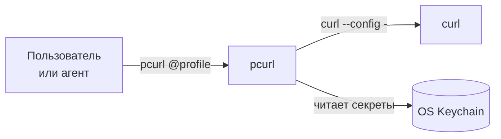

+++
title = 'pcurl: безопасный curl для AI-агентов и не только'
date = '2026-04-04T12:00:00+03:00'
author = 'sergeyfast'
+++

# pcurl: безопасный curl для AI-агентов и не только

Сколько раз вы копировали токены из каких-то несохранённых текстовых файлов, чатов в мессенджерах или еще откуда? Если повезло, то вместо этого всего был password manager (например `op run -- curl https://api.com -H "Authorization: Bearer $TOKEN"` через [1Password CLI](https://developer.1password.com/docs/cli/get-started/)). Но в реальной жизни, по моим наблюдениям, обычно не так.

И дальше токены попадают в `.bash_history`, во временные скрипты, которые обладают свойством "нет ничего более постоянного".
Еще бывает так, что токены хранятся в `.env`, и потом условный curl принимает `$TOKEN`. _"Никогда не читай файл .env"_

А потом наступает лень _(то есть Claude Code, ~~Codex~~, ~~Cursor~~, ~~Copilot~~)_, и ты запускаешь curl прямиком через команду в чате `curl` с `-H 'Authorization: Bearer ...'` – и токен уже "общественный".

Вот это все немного надоело, и спустя 2 часа AI-coding сессии получился [pcurl](https://github.com/vmkteam/pcurl) _(p – private, б – безопасность)_.

## Какую проблему решаем

Любой "оператор консоли или локального ai-чата", работающий с HTTP API, рано или поздно сталкивается с одним и тем же:

- Копирование токенов — каждый раз открываем браузер, копируем `Authorization` заголовок, вставляем в терминал.
- Небезопасное хранение — секреты оседают в `.env`, `.sh` файлах, истории shell, тикетах, чатах.
- AI-агенты видят секреты — при выполнении `curl` с заголовками авторизации токены попадают в контекст LLM и логи чата.

Хотелось получить инструмент, который:

1. Работает как обычный `curl` (drop-in replacement).
2. Хранит секреты в системном хранилище (OS Keychain).
3. Никогда не показывает секреты в терминале, логах или контексте AI-агента.

## Как это работает

`pcurl` — обёртка над `curl`, написанная на Go. Секреты хранятся в системном хранилище (macOS Keychain, Linux secret-service, Windows Credential Manager) и передаются в `curl` через stdin (`curl --config -`). Агент или пользователь видит только имя профиля.



### Именованные профили

Ключевая абстракция — профили. Каждый профиль привязан к хосту и содержит набор заголовков или кук:

```bash
# добавляем профиль — pcurl сам определит секретные заголовки
pcurl add https://api.example.com/data \
  -H 'Authorization: Bearer mytoken' \
  -H 'Accept: application/json'

# используем — просто добавляем @имя перед URL
pcurl @example https://api.example.com/data
pcurl @example https://api.example.com/data -X POST -d '{"key": 1}'

# без @ — обычный curl, без инъекции секретов
pcurl https://httpbin.org/get
```

При добавлении профиля `pcurl` интерактивно предлагает выбрать, куда сохранить каждый заголовок:

| Хранилище        | Когда использовать                                   |
| ---------------- | ---------------------------------------------------- |
| `keychain:<key>` | Секретные заголовки (Authorization, Cookie, API Key) |
| `env:<VAR>`      | Значение из переменной окружения                     |
| plain text       | Несекретные заголовки (Accept, Content-Type)         |

Браузерные шумовые заголовки (`sec-ch-*`, `sec-fetch-*`, `sentry-trace`) автоматически отфильтровываются.

Самый частый usecase – ` pcurl add` `<paste from Chrome: Copy as cURL>`. Пробел перед командой важен, он не сохраняет команду в `.bash_history`.
Если вызвать снова эту команду, она предложит обновить данные.

### Управление профилями

```bash
pcurl show              # список всех профилей
pcurl show github       # детали профиля (секреты замаскированы)
pcurl edit              # редактирование в $EDITOR
pcurl delete github     # удаление профиля
```

Или через конфиг (можно получить путь через `pcurl --help`, например будет лежать тут `~/.config/pcurl/profiles.toml`).

## Интеграция с AI-агентами

Киллер-фича: когда AI-агент исполняет обычный `curl`:

```bash
# агент видит и отправляет на сервер LLM:
curl https://api.example.com/data -H 'Authorization: Bearer sk-abc123secret'
```

С `pcurl` агент видит только:

```bash
pcurl @example https://api.example.com/data
```

Секрет не попадает ни в контекст, ни в логи, ни в историю чата. Агент _не может_ получить доступ к значению токена, даже если захочет _(но если очень захочет, и пользователь дал доступ до системы – агент сам может сходить в keychain)_.

### Автоматическая установка правил

```bash
pcurl install
```

Эта команда создаёт правила для агентов в:

- `~/.claude/CLAUDE.md` — Claude Code
- `~/.cursor/rules/pcurl.mdc` — Cursor
- `~/.windsurf/rules/pcurl.md` — Windsurf

Правила содержат список доступных профилей и инструкции: _использовать `pcurl @profile` вместо `curl` с заголовками авторизации_.

При добавлении или удалении профилей правила обновляются автоматически.

## Установка

```bash
# Homebrew
brew install vmkteam/tap/pcurl

# Go
go install github.com/vmkteam/pcurl/cmd/pcurl@latest
```

Требования: `curl` в PATH, доступ к системному хранилищу ключей. Работает на macOS, Linux и Windows.

## Сравнение с альтернативами

| Решение       | Секрет виден агенту | Работает офлайн | Drop-in для curl | Произвольные заголовки |
| ------------- | ------------------- | --------------- | ---------------- | ---------------------- |
| **pcurl**     | **Нет**             | **Да**          | **Да**           | **Да**                 |
| curl -H       | Да                  | Да              | —                | Да                     |
| ~/.netrc      | Нет                 | Да              | `--netrc`        | Нет (только login/password) |
| keychains.dev | Нет                 | Нет (SaaS)      | Да               | Да                     |
| op run (1Password) | Нет            | Да              | Нет (`op run --`) | Да                     |

## Пример из жизни

Допустим, вам нужно проверить Grafana dashboard или посмотреть issue в Sentry. Раньше:

```bash
# копируем токен из браузера, вставляем...
# токен в истории shell, в контексте агента, возможно в Slack
curl https://grafana.example.com/api/dashboards/home \
  -H 'Authorization: Bearer glsa_abc123...'
```

Теперь:

```bash
# один раз настроили профиль
pcurl add https://grafana.example.com/api/dashboards/home \
  -H 'Authorization: Bearer glsa_abc123...'

# используем — безопасно, удобно, навсегда
pcurl @grafana https://grafana.example.com/api/dashboards/home
pcurl @grafana https://grafana.example.com/api/datasources -s | jq .
```

Профили, по факту, это каталог всех сервисов, к которым у вас есть доступ. `pcurl show` — и вы видите полную картину.

## Чего pcurl не делает

Важно понимать границы:

- Не защищает от вредоносного агента, который целенаправленно читает `profiles.toml` или обращается к keychain.
- Нет TTL или автоматической ротации токенов.
- При выборе хранилища "Config" (вместо Keychain) секреты хранятся в открытом виде.

_Но это всё равно на порядок лучше, чем токены в bash history._

Еще pcurl версии v0.0.1 тестировался только на macOS. It works on my machine :) 
Поэтому фидбэк приветствуется. Бинарники из homebrew пока без подписей, поэтому `go install` пока предпочтительный выбор.

## Почему стоит

- Если вы работаете с API из терминала — `pcurl` экономит время.
- Если вы используете AI-агентов — `pcurl` защищает секреты.
- Если у вас в команде больше одного человека — стандартизируйте подход к авторизации в CLI.
- Установка занимает 30 секунд, добавление первого профиля — ещё 30.
- После: перевыпустите уже все токены со сроком жизни 30 дней.

_И нестареющая классика:_ ставьте лайки [vmkteam/pcurl](https://github.com/vmkteam/pcurl), подписывайтесь на [наш канал](https://t.me/vmkteamlabs)
