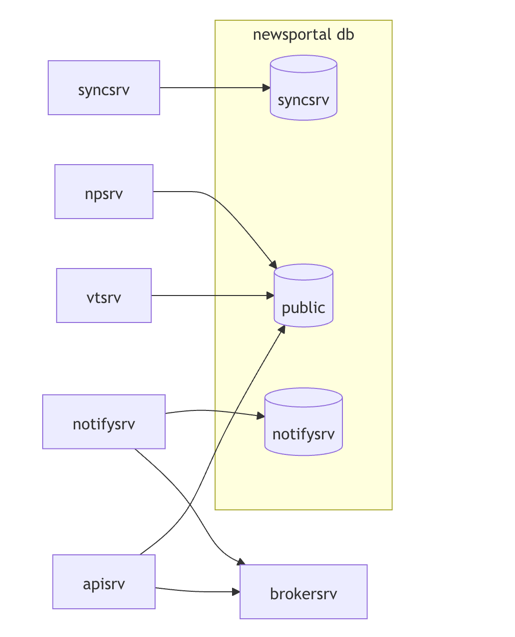
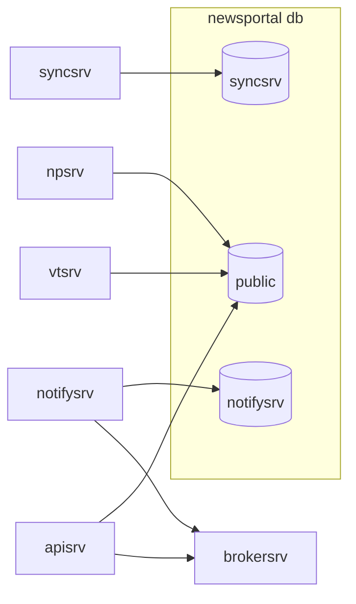

+++
date = '2025-05-14T17:36:34+03:00'
draft = false
title = 'Go Simple Architecture'
+++

# Простая архитектура // Go Simple Architecture

> Просто написать сложный код. Гораздо сложнее написать простой код.

Если сравнить подход с умными книжками, то ближе всего это похоже на "Сервисную многослойную архитектуру с элементами Clean Architecture или Hexagonal Architecture поверх JSON-RPC 2.0."
А теперь попробуем описать это все простыми словами.

## Кому не подойдет
1. Тем, кому нужен gRPC, и они точно понимают зачем _(производительность, микросервисы на разных языках, стриминг данных)_
2. Тем, кто любит REST и не готов посмотреть на что-то другое.

## Основные подходы

### Используемый тулинг (доступный из коробки)
* Шаблон проекта для создания нового сервиса
* Генерация слоя БД
* Генерация слоя админки
* Генерация документации по API c возможностью вызвать методы из UI
* Генерация клиентов для различных языков

### Снаружи
* **сервисы** (не микросервисы и не монолит)
* общаются между собой через **JSON-RPC 2.0** (в основном асинхронно через brokersrv)
* каждый сервис живет в своей схеме в **общей базе данных**
  * но может легко переехать в свою, если он не перекладывает данные между схемами
* у сервиса может быть **внешнее API** (JSON-RPC 2.0) **и внутреннее** (JSON-RPC 2.0)
* REST применим для работы с файлами
* сервисов обычно **немного**
* у сервисов есть **стандартизированные подходы** к метрикам/логам/ошибкам/трассировке

### Внутри
* обычно три слоя (но может быть два)
* строгое направление зависимостей (от внешнего к внутреннему)
* каждый слой знает только о слое ниже, но не наоборот
* в каждом слое свои модели
* поголовное отсутствие интерфейсов _(используется только в бизнес-логике, если применимо)_
  * _Go proverbs: The bigger the interface, the weaker the abstraction._
* зафиксированные библиотеки 
  * работа с БД через mfd-generator (в основе go-pg)
  * HTTP: echo
  * RPC: zenrpc
  * cron: vmkteam/cron
  * slog: vmkteam/embedlog

#### Слои
* pkg
  * _Основные_
    * `db` – слой с базой данных
    * `\<domain\>` – слой с бизнес-логикой, всегда равен названию проекта
    * `rpc` – слой с API
  * _Дополнительные_
    * `app` – приложение
    * `client` – клиенты до других сервисов
      * `\<service name\>` – пакет с другим сервисом, в котором лежит один файл с клиентом, полученный через rpcgen
    * `\<otherpkg\>` – любой другой самостоятельный пакет, который может использоваться в любых слоях
    * `rest` – если нужен rest как самостоятельный слой
    * `vt` – если нужно RPC для админки

#### Как не нужно называть пакеты
  * Не объясняет, что за домен или логика
    * domain, logic → `\<domain\>`, например `newsportal`
  * Слишком утилитарные названия, как `util`. Они не объясняют, что внутри пакета.
    * handlers, service, api – не объясняют, что за сервис → `rest, rpc`.
    * repositories, repository – нет четкого понимания, что за репо → `db`

## Примеры сервисов

### Задача 1. Простой сайт с админкой

Назовем проект newsportal. Делаем один сервис `apisrv`, в котором будут следующие пакеты:
* cmd/
  * `apisrv` – main, инициализация коннектов и передача из в app
* pkg/
  * `app` – приложение, которое умеет запускаться
  * `db` – слой с базой данных
  * `newsportal` – слой с бизнес-логикой
  * `rpc` – rpc для сайта
  * `vt` – rpc для админки

**Процесс**
1. Берем начальный шаблон gold-apisrv
2. Строим систему снизу вверх: `db → newsportal → rpc`
3. Тестируем последний слой с `rpc` (или с `newsportal`, если очень важно)

Используем соглашения по неймингу:
* `/v1/rpc/` – публичное API
* `/v1/vt/` – API для админки
* `/int/rpc/` – приватное API для межсервисного взаимодействия _(в данном проекте отсутствует)_

### Задача 2. Сервис с большой бизнес логикой

Название проекта newsportal. 
Очень большое API для мобильного приложения и сайта, с возможностью отправки пушей, почты.
Есть фоновые процессы бизнес-логики, и процессы синхронизации данных. 

Определим список сервисов:
* `apisrv` – сервис со всем публичным API
* `vtsrv` – сервис с API для админки
* `notifysrv` – сервис отправки пушей/почты
* `npsrv` – _(np = сокр. от newsportal)_ – сервис для фоновых процессов бизнес-логики
  * `syncsrv` – сервис для синхронизации данных, если он уже не помещается в `npsrv`

Межсервисное взаимодействие целиком асинхнронное, через brokersrv:
* `apisrv -> brokersrv <- notifysrv`

База данных `newsportal`:
* `public` – apisrv, vtsrv, npsrv
* `notifysrv` – notifysrv
* `syncsrv` – syncsrv (если данные надо переложить в public, то это возможно в рамках ответственности сервиса `syncsrv`)

